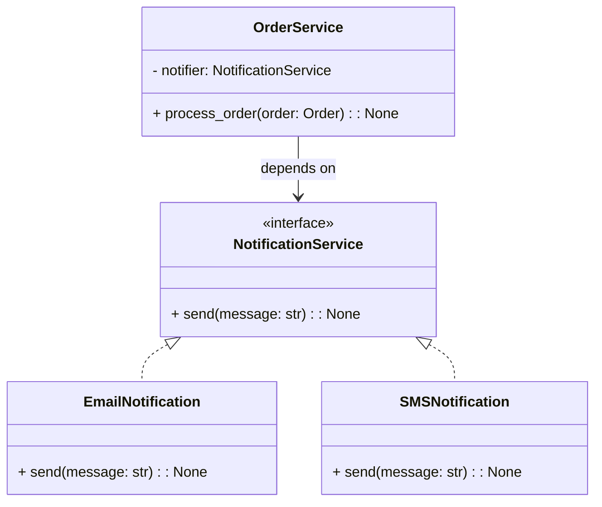

# E-commerce Backend Core

**SOLID Architecture with Dependency Injection**

This project demonstrates a **clean, SOLID-compliant backend core design** for an e-commerce system.
It focuses on **order processing**, **Dependency Injection (DI)**, and **swappable notification mechanisms** without modifying business logic.

This is **architecture-first code**, suitable for interviews, academic evaluation, and real backend systems.

---

## Project Objective

- Process orders independently of infrastructure
- Decouple business logic from notification mechanisms
- Enable runtime switching between Email and SMS notifications
- Follow SOLID principles strictly

---

## Design Principles Applied

- **Single Responsibility Principle (SRP)**
- **Open/Closed Principle (OCP)**
- **Dependency Inversion Principle (DIP)**
- Interface-driven design
- Loose coupling and high cohesion

---

## High-Level Architecture (UML)



---

## Project Structure

```
ecommerce_core/
│
├── notifications/
│   ├── __init__.py
│   ├── base.py        # Notification interface
│   ├── email.py       # Email notification implementation
│   └── sms.py         # SMS notification implementation
│
├── order/
│   ├── __init__.py
│   ├── entity.py      # Order domain entity
│   └── service.py     # Order processing logic
│
└── main.py             # Application entry point (composition root)
```

---

## How to Run

```bash
cd ecommerce_core
python main.py
```

---

## Sample Output

```
[EMAIL] Order Update: Order #101 has been successfully paid. Total amount: $249.99
[SMS] Order Update: Order #102 has been successfully paid. Total amount: $99.99
```

---

## Why This Design Matters

- Order logic is **closed for modification**
- Infrastructure is **open for extension**
- Notification providers are **runtime interchangeable**
- System is **easy to test and maintain**
- Matches real-world backend service design

---

## Testing Advantage

Dependencies can be mocked or replaced with fakes without touching production code.

---

## Possible Extensions

- Payment Gateway DI (Stripe / SSLCommerz)
- REST API using FastAPI or Django
- Event-driven notification system
- Repository pattern for persistence
- Unit tests with mocks

---
