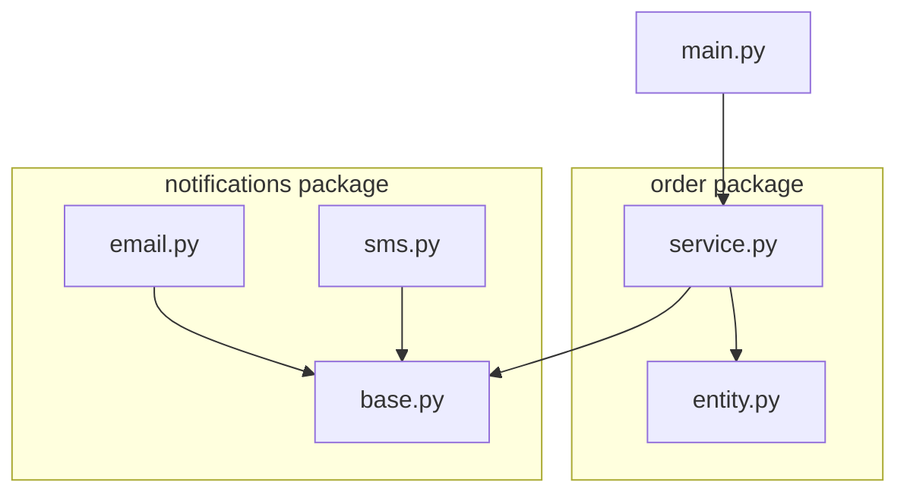
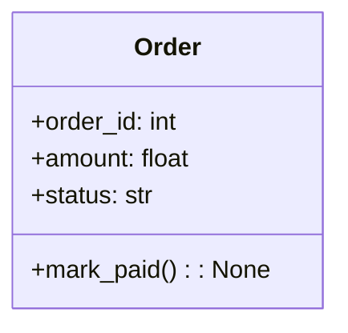
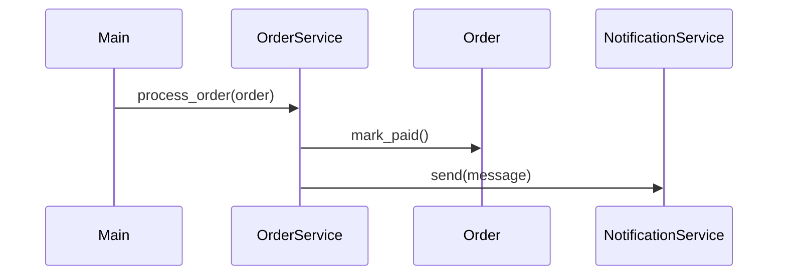

# E-commerce Backend Core

**Detailed Architecture & Code Explanation**

This document provides a **file-by-file and line-by-line explanation** of the project, including **UML diagrams** and execution flow.

---

## System Overview

The system separates **business logic** from **infrastructure concerns** using Dependency Injection.

```
OrderService
 └── NotificationService (interface)
       ├── EmailNotification
       └── SMSNotification
```

---

## Package-Level View (UML)



---

## notifications/base.py

### Notification Interface

```python
from abc import ABC, abstractmethod
```

- Imports tools for defining abstract base classes.

```python
class NotificationService(ABC):
```

- Defines a contract for all notification providers.

```python
@abstractmethod
def send(self, message: str) -> None:
```

- Forces all implementations to provide a `send` method.
- Enforces **Dependency Inversion Principle**.

---

## notifications/email.py

### Email Notification Implementation

```python
from notifications.base import NotificationService
```

- Depends on abstraction, not concrete logic.

```python
class EmailNotification(NotificationService):
```

- Concrete implementation of the interface.

```python
def send(self, message: str) -> None:
```

- Sends order updates via email (simulated using print).

---

## notifications/sms.py

### SMS Notification Implementation

```python
class SMSNotification(NotificationService):
```

- Alternative notification provider.

```python
def send(self, message: str) -> None:
```

- No changes required in order logic to use SMS instead of Email.

---

## order/entity.py

### Order Domain Model (UML)



```python
class Order:
```

- Core business entity.

```python
self.status = "CREATED"
```

- Initial state of an order.

```python
def mark_paid(self):
    self.status = "PAID"
```

- Encapsulates state transition logic.

---

## order/service.py

### Order Processing Logic

```python
class OrderService:
```

- Handles order-related business rules.

```python
def __init__(self, notifier: NotificationService):
```

- Dependency is injected from outside.
- Service does not create its own dependencies.

```python
order.mark_paid()
```

- Core business operation.

```python
self.notifier.send(...)
```

- Delegates notification responsibility.
- Remains unaware of Email or SMS details.

---

## main.py

### Application Composition Root

```python
email_notifier = EmailNotification()
order_service = OrderService(email_notifier)
```

- Concrete dependencies are wired at runtime.

```python
sms_notifier = SMSNotification()
```

- Switching provider does not affect business logic.

---

## Runtime Execution Flow (Sequence UML)



---

## How the Code Works (Step-by-Step)

1. Application starts in `main.py`
2. A notification provider is selected
3. `OrderService` is created with injected dependency
4. Order status is updated
5. Notification is sent via the selected provider

---

## Testing Advantage

Because dependencies are injected:

```python
class FakeNotifier(NotificationService):
    def send(self, message: str):
        self.last_message = message
```

- No external services needed
- Deterministic and fast tests
- High test coverage achievable

---
